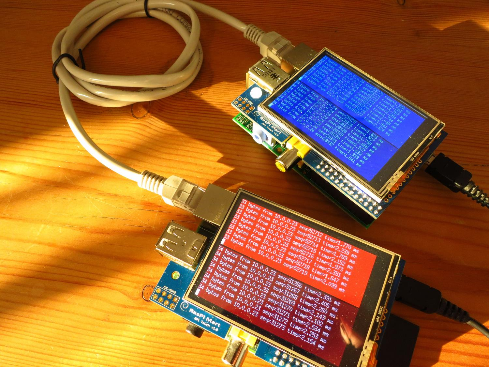

# stping/dgping: TCP and UDP ping

**dgping** and **stping** provide a ping-like client and server
for `SOCK_DGRAM` (UDP)
and `SOCK_STREAM` (TCP).

Run either daemon to listen for packets on a particular port:

    ; ./dgpingd 127.0.0.1 2108
    listening on 127.0.0.1:2108 UDP/IP

And run the client like you would for ICMP ping, to the same port:

    ; ./dgping -c 3 127.0.0.1 2108
    34 bytes from 127.0.0.1 seq=0 time=0.606 ms
    34 bytes from 127.0.0.1 seq=1 time=0.218 ms
    34 bytes from 127.0.0.1 seq=2 time=0.349 ms
    
    - DGRAM Ping Statistics -
    3 transmitted, 3 received, 0 timed out, 0 disregarded, 0.0% packet loss
    round-trip min/avg/max/stddev = 0.218/0.391/0.606/0.197 ms

The clients respond to SIGINFO if your OS provides that (Linux doesn't),
giving the current status:

    4/4 packets, 0 timed out, 0 disregarded, 0.0% loss, min/avg/max/stddev = 0.055/0.061/0.077/0.011 ms

## What would I use it for?

I don't know. I hope you like it.

### Building from source

Clone with submodules (contains required .mk files):

    ; git clone --recursive https://github.com/katef/stping.git

To build and install:

    ; bmake -r install

You can override a few things:

    ; CC=clang bmake -r
    ; PREFIX=$HOME bmake -r install

You need bmake for building. In order of preference:

 1. If you use some kind of BSD (NetBSD, OpenBSD, FreeBSD, ...) this is make(1).
    They all differ slightly. Any of them should work.
 2. If you use Linux or MacOS and you have a package named bmake, use that.
 3. If you use Linux and you have a package named pmake, use that.
    It's the same thing.
    Some package managers have bmake packaged under the name pmake.
    I don't know why they name it pmake.
 4. Otherwise if you use MacOS and you only have a package named bsdmake, use that.
    It's Apple's own fork of bmake.
    It should also work but it's harder for me to test.
 5. If none of these are options for you, you can build bmake from source.
    You don't need mk.tar.gz, just bmake.tar.gz. This will always work.
    https://www.crufty.net/help/sjg/bmake.html

When you see "bmake" in the build instructions above, it means any of these.

Building depends on:

 * Any BSD make.
 * A C compiler. Any should do, but GCC and clang are best supported.
 * ar, ld, and a bunch of other stuff you probably already have.

Ideas, comments or bugs: kate@elide.org

